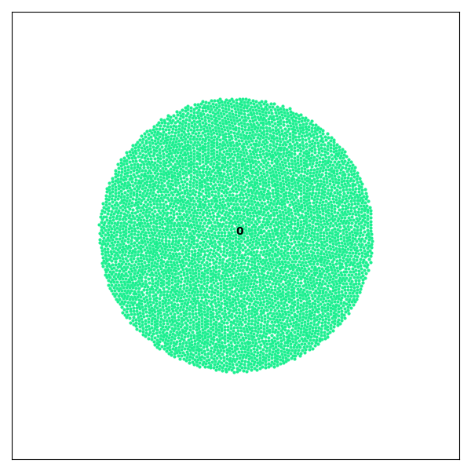
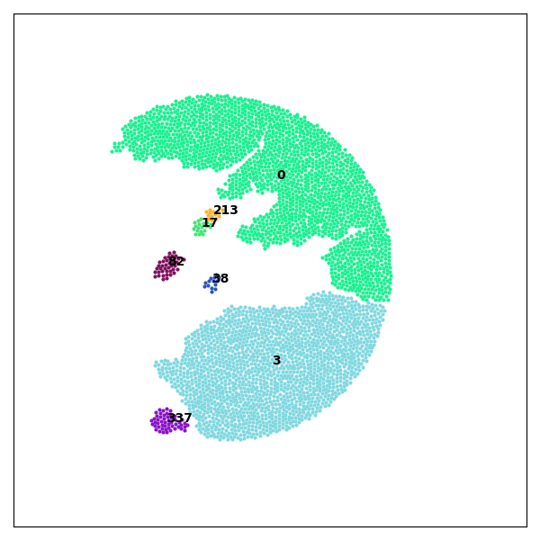
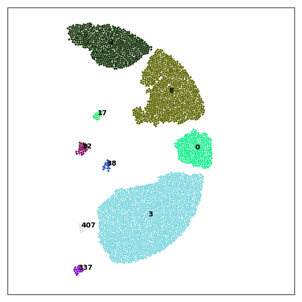

.. _examples:

Examples
========

2D Fragmentation Example
------------------------

This example demonstrates how to use **Crispy** to load a set of `.agdd` files obtained from a `GranOO <https://www.granoo.org/>`__ simulation of 2D disc impact and visualize fragmentation over time.

Code Example
^^^^^^^^^^^^

.. code-block:: python

   import crispy as cp

   detector = cp.FragmentDetector("path/to/your/agdd/files")
   detector.build_fragments()

   for it in range(detector.iterations_nb):
       detector.plot2D(iteration=it)

This will generate one 2D image per iteration in your working directory, as well as a 
stack plot of the area repartition over iterations and a graph of the fragments heredity.

.. note::

   Make sure the work directory contains valid `.agdd` files, the iteration sorting process is based on filename. For `.agdd` format, see details in the :ref:`usage` section.

Preview of Generated Images
^^^^^^^^^^^^^^^^^^^^^^^^^^^

   

Run the Example
^^^^^^^^^^^^^^^^^^^^^^^^^^^^^^^^^

The full 2D fragmentation example is available in the project repository, inside the ``examples/2D_impact`` folder.

To run it locally, use the following commands:

.. code-block:: bash

   cd examples/2D_impact
   python 2D_impact.py

This script will execute the 2D fragmentation detection and save images for each iteration of the simulation in a subfolder ``examples/2D_impact/agdd/img`` of the working directory.

.. note::
   Make sure you have installed all required dependencies listed in the :ref:`installation` section before running the example.

You can inspect or modify the source code here:

- :file:`examples/2D_impact/2D_impact.py`
- `.agdd` input files are stored in :file:`examples/2D_impact/agdd/`

For more details on `.agdd` input file format, see the :ref:`usage` section.

3D Fragmentation Example
------------------------
